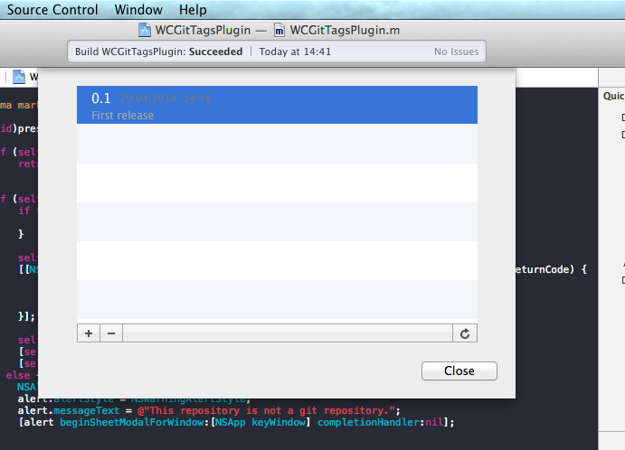

##Overview
This Xcode plugin lets you add tags via Xcode's Source Control menu.

I'm [@wczekalski](http://twitter.com/wczekalski).  I am available for freelance work. [Mail me](mailto:me@wczekalski.com) if you are interested.

##Features
You can list, add (either annotated or lightweight) and remove tags, equivalents to the following:
  - `git tag`
  - `git tag x`
  - `git tag -a x -m "x"`
  - `git push --tags`
  - `git fetch --tags`
   
  All changes are synced with a remote.

##Installation
You can install it with [Alcatraz](http://alcatraz.io) ***or***:
  1. Clone/download the source
  2. Open `WCGitTagsPlugin.xcodeproj`
  3. Build
  4. Relaunch Xcode
